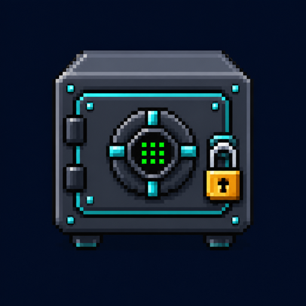
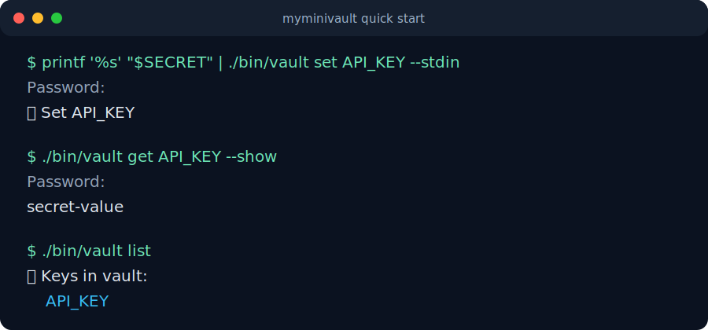
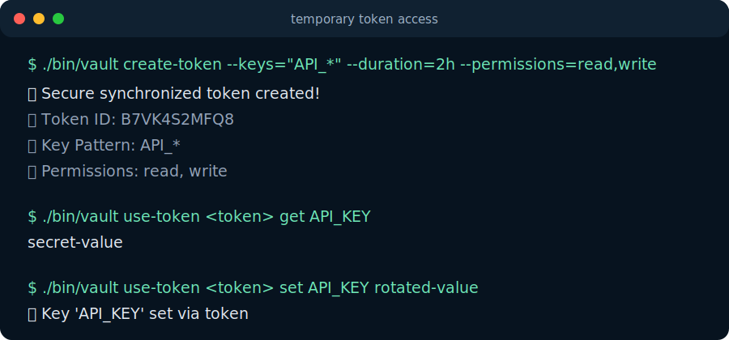
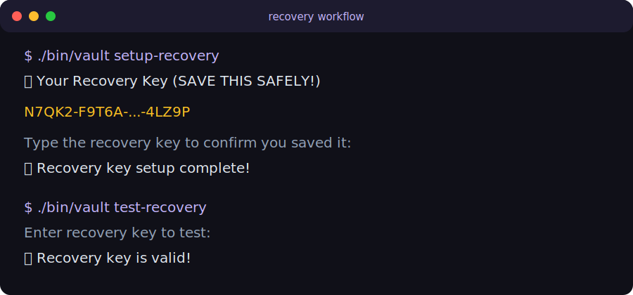

<p align="center">
  
</p>

<h1 align="center">myminivault</h1>

<p align="center">
  A local encrypted command-line vault written in Go.
</p>

<p align="center">
  
  
  
  
  
  
  
  
</p>

`myminivault` stores key/value secrets in an encrypted local vault file. It supports password recovery, temporary access tokens, backup/import/export utilities, and basic security auditing.

> Experimental personal project. Not audited. Do not rely on it as a production password manager.

## Preview



## Build

Install the latest tagged release with Go:

```bash
go install github.com/olelbis/myminivault/cmd/vault@latest
```

GitHub Releases also publish installable packages:

- `.deb` for Debian/Ubuntu-style Linux systems
- `.rpm` for RPM-based Linux systems
- `.pkg` for macOS arm64
- `.tar.gz` archives for direct unpacking

Release assets include SHA-256 checksum files and GitHub artifact attestations when built by the release workflow.

Token keychain support is intentionally platform-specific. On macOS, `token_key_storage=auto` prefers macOS Keychain for token master-key material when available. On Linux, token key storage is file-based by design for now; `vault doctor` can report Secret Service readiness when both a DBus session and `secret-tool` are present, but the supported Linux storage path remains the portable `vault-token.key` fallback.

Build the CLI from the repository root:

```bash
go build -o bin/vault ./cmd/vault
```

Run it:

```bash
./bin/vault help
```

For development, you can also run it directly:

```bash
go run ./cmd/vault help
```

## Quick Start

Create or update a secret:

```bash
./bin/vault set API_KEY secret-value
```

Read it back:

```bash
./bin/vault get API_KEY --show
```

List keys without printing values:

```bash
./bin/vault list
```

Create a backup:

```bash
./bin/vault backup
```

## Common Commands

| Command | Purpose |
| --- | --- |
| `set <key> <value>` | Store or update a value |
| `get <key> --show` | Print a stored value intentionally |
| `copy <key>` | Copy a value to the clipboard without printing it |
| `delete <key>` | Delete a key |
| `list` | List key names |
| `search <pattern> --show` | Search keys and print matching values intentionally |
| `backup` | Create a timestamped backup |
| `export --output <file>` | Write shell-safe export lines to a restrictive plaintext file |
| `import <file>` | Import values from a file |
| `setup-recovery` | Create a recovery key |
| `recover` | Reset the master password with the recovery key |
| `create-token` | Create temporary token access |
| `use-token` | Use a temporary token |
| `security-audit` | Print local vault status |
| `doctor` | Check runtime file permissions and local health |
| `inspect-runtime` | List active and legacy runtime files without decrypting |

Token commands can emit JSON for third-party integrations:

```bash
vault use-token "$MYMV_TOKEN" get API_KEY --json
```

```json
{"key":"API_KEY","value":"secret"}
```

## Screenshots





## Documentation

- [Project Site](https://olelbis.github.io/myminivault/)
- [User Manual](docs/user-manual.md)
- [Development Guide](docs/development.md)
- [Security Model](docs/security.md)
- [Coverage Notes](docs/coverage.md)
- [Recovery Policy](docs/recovery-policy.md)
- [Token Sync Policy](docs/token-sync-policy.md)
- [Changelog](CHANGELOG.md)
- [Backlog](BACKLOG.md)

## Runtime Files

The CLI stores runtime files in a dedicated runtime directory instead of the current project folder:

```text
~/.myminivault/
```

Set `MYMINIVAULT_HOME=/path/to/dir` to use a different runtime directory for tests, automation, or isolated vaults. On startup, if legacy runtime files are found in the current working directory and the new runtime directory does not already contain matching files, the CLI migrates them into the runtime directory.

These files are ignored by Git because they may contain encrypted secrets, keys, logs, or local runtime state.

### `MYMINIVAULT_HOME`

`MYMINIVAULT_HOME` changes where every runtime file is read and written. It does not change the source tree, release assets, or Go build cache.

Use it for temporary or isolated vaults:

```bash
MYMINIVAULT_HOME=/tmp/myminivault-demo vault set API_KEY hello
MYMINIVAULT_HOME=/tmp/myminivault-demo vault get API_KEY --show
```

Use a persistent custom location:

```bash
export MYMINIVAULT_HOME="$HOME/.myminivault-work"
vault set API_KEY hello
```

Operational notes:

- the directory is created with `0700` permissions
- all vault, token, recovery, config, log, backup, and lock files move under that directory
- changing `MYMINIVAULT_HOME` selects a different vault context
- legacy files from the current working directory are migrated only when the target file does not already exist
- avoid pointing it at a Git repository, shared folder, cloud-sync folder, or world-readable directory unless that is intentional

Inspect the active runtime location without decrypting secrets:

```bash
vault inspect-runtime
MYMINIVAULT_HOME=/tmp/myminivault-demo vault inspect-runtime
```

The command prints active runtime files, legacy current-directory files, modified times, sizes, file modes, encrypted container format details where available, and a recovery/main-vault relationship summary. It never decrypts vault data or prints stored values.

Encrypted runtime files saved by current releases start with a small cleartext `MYMV` container header. Current saves write container format `v2`, which identifies the file kind and records non-sensitive crypto metadata such as algorithm, KDF, scrypt parameters, salt size, nonce size, and payload layout. The `MYMV v2` header, metadata, and salt are authenticated with AES-GCM AAD, so tampering with that cleartext context makes decryption fail. It does not expose stored keys, values, recovery metadata, token contents, or encrypted vault metadata. Older `MYMV v1` and salt-plus-ciphertext files remain readable and are reported as older formats until they are rewritten by a save operation.

On normal startup, commands tighten existing runtime file permissions to `0600` when possible. `doctor` and `inspect-runtime` remain non-mutating inspection commands, so they report the current state without auto-fixing it. `vault doctor` also checks recovery snapshot freshness and non-decrypting recovery container compatibility so stale or mismatched recovery files are easier to spot before an emergency.

| File | Purpose |
| --- | --- |
| `vault.db` | Main encrypted vault |
| `vault.db.bak` | Backup of previous main vault version |
| `vault.db.recovery` | Recovery-encrypted vault copy |
| `vault-token.key` | Local token master key when file-backed token key storage is used |
| `shared-token-vault.json` | Encrypted shared vault used by token access |
| `vault-tokens.json` | Token registry metadata |
| `vault.log` | Audit log |
| `vault-config.json` | Optional config override |
| `.myminivault.lock` | Inter-process lock file |

## Versioning

`myminivault` uses `v0.x.y` releases while the CLI is still evolving.

Each release is published as a Git tag and a GitHub Release, with notes recorded in `CHANGELOG.md`. Release assets currently include Linux and macOS archives, Linux `.deb`/`.rpm` packages, macOS `.pkg` packages, SHA-256 checksum files, and GitHub artifact attestations.

The CLI-visible version is kept in sync with the current release tag. Patch releases are used for documentation, tests, packaging, fixes, and small refactors. Minor releases are reserved for user-facing behavior changes or larger security/compatibility work.

If the vault file format changes, the release notes should include migration guidance and any compatibility limits.

## License

MIT. See [LICENSE](LICENSE).

## Credits

Created and maintained by [olelbis](https://github.com/olelbis).
